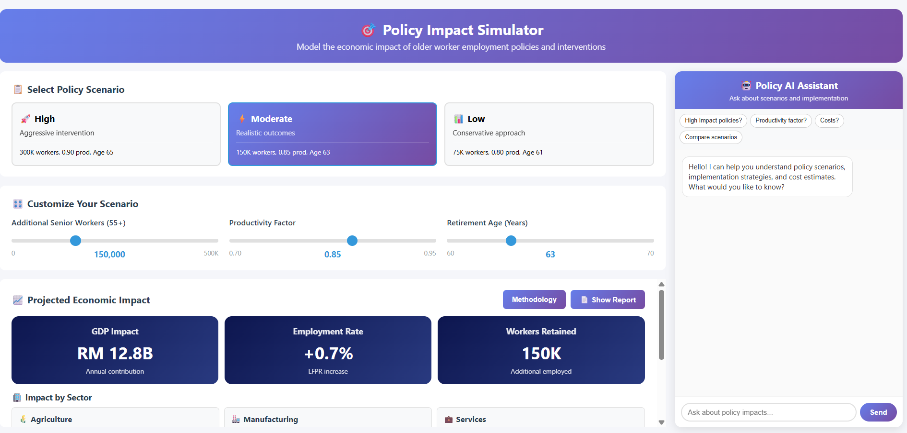
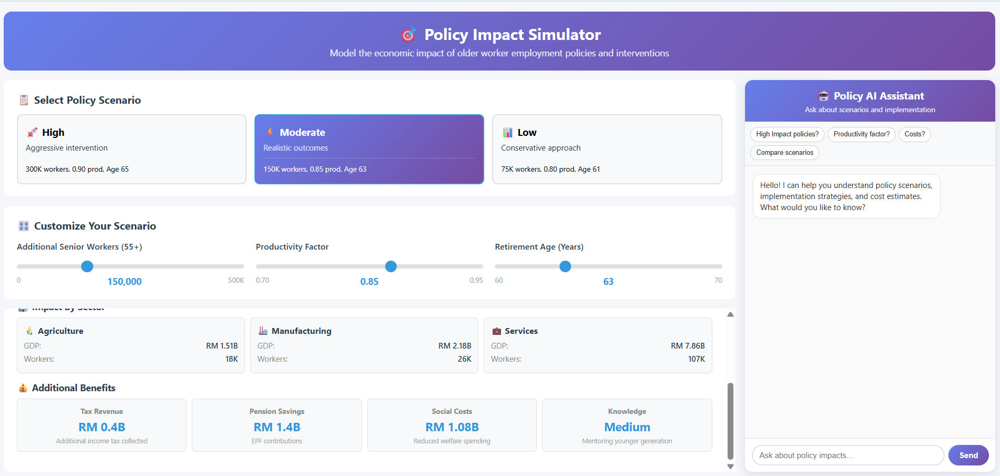
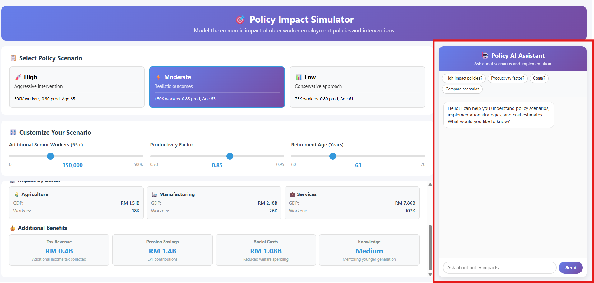
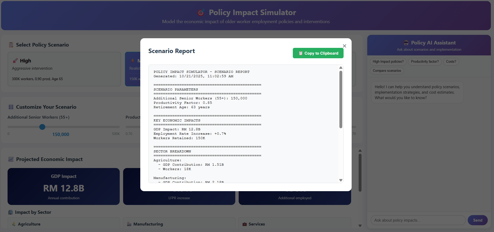

# Policy-Impact-Simulator
Interactive policy simulator modeling economic impact of senior worker employment policies. Real-time GDP, tax, EPF analysis with AI-powered recommendations. Built with vanilla JavaScript + Google Gemini AI.
# 🎯 Policy Impact Simulator


An interactive web-based tool for modeling the economic impact of older worker employment policies and interventions, featuring AI-powered policy recommendations and real-time impact analysis.

## 📋 Table of Contents
- [Overview](#overview)
- [Features](#features)
- [Live Demo](#live-demo)
- [Screenshots](#screenshots)
- [Quick Start](#quick-start)
- [Installation](#installation)
- [Deployment](#deployment)
- [How It Works](#how-it-works)
- [Methodology](#methodology)
- [Technology Stack](#technology-stack)
- [API Configuration](#api-configuration)
- [Usage Guide](#usage-guide)
- [Project Structure](#project-structure)
- [Data Sources](#data-sources)
- [Contributing](#contributing)
- [License](#license)
- [Contact](#contact)

## 🌍 Overview

The **Policy Impact Simulator** is a data-driven decision-support tool designed to help policymakers, economists, and researchers quantify the economic benefits of policies aimed at retaining senior workers (age 55+) in the workforce.

### The Challenge

Malaysia, like many nations, faces an aging workforce crisis:
- **Workforce participation** for workers 55+ is declining
- **Brain drain** of experienced professionals due to early retirement
- **Economic impact** of losing productive senior workers
- **Pension sustainability** concerns with fewer contributors

### The Solution

This simulator provides:
1. **Real-time economic modeling** of policy interventions
2. **Sector-specific analysis** (Agriculture, Manufacturing, Services)
3. **Multi-dimensional impact assessment** (GDP, tax revenue, EPF, social costs)
4. **AI-powered policy recommendations** via intelligent chatbot
5. **Scenario comparison** (High/Moderate/Low intervention levels)

## ✨ Features

### 📊 Three Pre-Built Policy Scenarios

#### 🚀 High Intervention
- **300,000** additional senior workers
- **0.90** productivity factor
- Retirement age: **65 years**
- Expected GDP Impact: **RM 27B+**

#### ⚡ Moderate Intervention (Default)
- **150,000** additional senior workers
- **0.85** productivity factor
- Retirement age: **63 years**
- Expected GDP Impact: **RM 13-15B**

#### 📊 Low Intervention
- **75,000** additional senior workers
- **0.80** productivity factor
- Retirement age: **61 years**
- Expected GDP Impact: **RM 6-8B**

### 🎛️ Customizable Parameters

**Interactive Sliders:**
- **Worker Count**: 0 to 500,000 additional workers
- **Productivity Factor**: 0.70 to 0.95 (accounts for age-related factors)
- **Retirement Age**: 60 to 70 years

### 📈 Real-Time Impact Metrics

#### Key Economic Indicators:
- **💰 GDP Impact**: Total annual economic contribution
- **📊 Employment Rate**: Labor force participation rate (LFPR) increase
- **👥 Workers Retained**: Total additional workers employed

#### Sector Breakdown:
- **🌾 Agriculture**: 5% of workforce, sector-specific GDP
- **🏭 Manufacturing**: 30% of workforce, sector-specific GDP
- **💼 Services**: 65% of workforce, sector-specific GDP

#### Additional Benefits:
- **💵 Tax Revenue**: Additional income tax collected (6% avg rate)
- **🏦 Pension Savings**: EPF contributions (23% total rate)
- **🎗️ Social Costs**: Reduced welfare spending
- **🧠 Knowledge Retention**: Qualitative mentoring value

### 🤖 AI Policy Assistant

**Powered by Google Gemini AI:**
- Context-aware responses based on current scenario
- Quick-answer buttons for common questions
- Implementation strategy recommendations
- Cost-benefit analysis explanations
- Policy comparison capabilities

**Pre-loaded Questions:**
- "What policies needed for High Impact?"
- "How does productivity factor work?"
- "What are implementation costs?"
- "Compare scenarios"

### 📄 Comprehensive Reporting

- **Full scenario reports** with all metrics
- **Copy-to-clipboard** functionality
- **Methodology documentation** with data sources
- **Export-ready format** for presentations

## 🎬 Live Demo

**[View Live Demo](#)** *(Add your deployed Netlify URL here)*

**Try This:**
1. Select "High Intervention" scenario
2. Adjust retirement age to 67
3. See GDP impact increase to ~RM 30B
4. Ask AI: "What policies achieve this?"

## 📸 Screenshots

### Main Dashboard

*Interactive controls and real-time economic projections*

### Scenario Comparison

*Pre-built policy scenarios for quick modeling*

### AI Assistant

*Context-aware policy recommendations*

### Detailed Report

*Comprehensive economic impact report*

## 🚀 Quick Start

### Run Locally (No Installation Required)

1. **Download the files**
```bash
git clone https://github.com/yourusername/policy-impact-simulator.git
cd policy-impact-simulator
```

2. **Open in browser**
```bash
# Just open index.html in your browser
# Or use a simple HTTP server:
python -m http.server 8000
# Then visit: http://localhost:8000
```

3. **Note**: AI chat requires API setup (see [API Configuration](#api-configuration))

## 📦 Installation

### Prerequisites
- Modern web browser (Chrome, Firefox, Safari, Edge)
- Text editor (VS Code recommended)
- Node.js 14+ (for Netlify Functions)
- Google Gemini API Key

### Local Development Setup

1. **Clone the repository**
```bash
git clone https://github.com/yourusername/policy-impact-simulator.git
cd policy-impact-simulator
```

2. **Set up environment variables**

Create `netlify/functions/.env`:
```
GEMINI_API_KEY=your_api_key_here
```

3. **Install Netlify CLI (for testing functions)**
```bash
npm install -g netlify-cli
```

4. **Run development server**
```bash
netlify dev
```

Visit `http://localhost:8888`

## 🌐 Deployment

### Deploy to Netlify (Recommended)

**Method 1: Via GitHub (Recommended)**

1. Push your code to GitHub
2. Go to [Netlify](https://app.netlify.com)
3. Click "New site from Git"
4. Select your repository
5. Build settings are auto-configured via `netlify.toml`
6. Add environment variable: `GEMINI_API_KEY`
7. Deploy!

**Method 2: Netlify CLI**

```bash
# Login to Netlify
netlify login

# Deploy to production
netlify deploy --prod
```

**Method 3: Drag & Drop**

1. Go to [Netlify Drop](https://app.netlify.com/drop)
2. Drag your project folder
3. Add environment variables in site settings
4. Done!

### Alternative: Deploy to Vercel

```bash
npm install -g vercel
vercel --prod
```

## 🛠 How It Works

### Economic Model

The simulator uses a multi-factor economic model based on official Malaysian government data:

#### 1. GDP Impact Calculation

```
GDP Impact = Workers × Productivity Factor × Retirement Factor × Base Productivity

Where:
- Workers: Number of additional senior workers (55+)
- Productivity Factor: 0.70-0.95 (age-adjusted productivity)
- Retirement Factor: 1 + ((Retirement Age - 60) × 0.02)
- Base Productivity: RM 99,265 per worker/year (MITI 2024)
```

**Example:**
- 150,000 workers × 0.85 productivity × 1.06 retirement factor × RM 99,265
- = **RM 13.5 billion** annual GDP impact

#### 2. Employment Rate Impact

```
LFPR Increase = (Additional Workers / Total Labor Force) × 100

Total Malaysian Labor Force: 21 million (DOSM 2024)
```

#### 3. Tax Revenue

```
Tax Revenue = Workers × Avg Salary × Tax Rate

Where:
- Avg Salary: RM 60,000/year
- Tax Rate: 6% (effective average, LHDN)
```

#### 4. EPF Contributions

```
EPF Savings = Workers × Avg Salary × Total EPF Rate

Where:
- Employee Contribution: 11%
- Employer Contribution: 12%
- Total Rate: 23% (KWSP 2024)
```

#### 5. Social Cost Savings

```
Welfare Reduction = Workers × Annual Welfare Per Person

Where:
- Welfare Cost: RM 7,200/person/year (Budget 2025)
```

#### 6. Sector Distribution

**Fixed allocation based on DOSM workforce data:**
- Agriculture: 5%
- Manufacturing: 30%
- Services: 65%

Each sector receives proportional GDP contribution based on total impact.

### Knowledge Retention Score

**Qualitative metric based on:**
```
Score = ((Retirement Age - 60) / 10 × 50) + (Productivity × 50)

Levels:
- 75+: Very High (optimal mentoring capacity)
- 60-74: High (strong knowledge transfer)
- 45-59: Medium (moderate transfer)
- <45: Low (limited transfer)
```

## 📊 Methodology

### Calculation Methodology

All calculations are based on verified data from official Malaysian sources:

#### GDP Impact
- **Base Productivity**: RM 99,265 per worker annually
- **Source**: Ministry of Investment, Trade and Industry (MITI) 2024
- **Assumptions**: 
  - Productivity decreases with age (0.70-0.95 factor)
  - Later retirement increases contribution (2% per year)

#### Tax Revenue
- **Average Salary**: RM 60,000/year
- **Effective Tax Rate**: 6%
- **Source**: Inland Revenue Board Malaysia (LHDN)
- **Note**: Accounts for progressive tax structure

#### EPF Contributions
- **Employee Rate**: 11%
- **Employer Rate**: 12%
- **Total**: 23%
- **Source**: Employees Provident Fund (KWSP) 2024

#### Social Costs
- **Welfare Savings**: RM 7,200 per person/year
- **Source**: Malaysia Budget 2025
- **Includes**: Reduced unemployment benefits, healthcare subsidies

#### Sector Distribution
- **Agriculture**: 5% workforce
- **Manufacturing**: 30% workforce
- **Services**: 65% workforce
- **Source**: Department of Statistics Malaysia (DOSM)

### Limitations & Assumptions

⚠️ **Important Considerations:**

1. **Productivity Factor**: Assumes age-related productivity decline; actual varies by sector
2. **Salary Assumptions**: Uses national average; high variance by industry/role
3. **Static Model**: Doesn't account for inflation, economic cycles, or policy feedback loops
4. **Labor Supply**: Assumes sufficient senior workers available and willing
5. **Sector Flexibility**: Real-world sector distribution may differ from model

**Disclaimer**: This tool provides estimates for policy planning. Actual results depend on implementation quality, economic conditions, and specific policy designs.

## 💻 Technology Stack

### Frontend
- **HTML5**: Semantic structure, single-page application
- **CSS3**: Custom gradients, animations, grid layout
- **Vanilla JavaScript**: No framework dependencies, lightweight
- **Responsive Design**: Optimized for desktop use

### Backend
- **Netlify Functions**: Serverless API for AI chat
- **Node.js**: Runtime environment
- **Google Gemini AI**: Conversational policy assistant

### Deployment
- **Netlify**: Hosting + serverless functions
- **Environment Variables**: Secure API key storage
- **Custom Domain Support**: HTTPS by default

## 🔑 API Configuration

### Getting a Google Gemini API Key

1. **Visit Google AI Studio**
   - Go to [https://makersuite.google.com/app/apikey](https://makersuite.google.com/app/apikey)

2. **Sign in**
   - Use your Google account

3. **Create API Key**
   - Click "Get API Key"
   - Copy the generated key

4. **Add to Netlify**
   - Site Settings → Environment Variables
   - Key: `GEMINI_API_KEY`
   - Value: Your API key

### API Endpoint

The chat function is at `netlify/functions/chat.js`:

```javascript
POST /.netlify/functions/chat
Content-Type: application/json

{
  "message": "User question",
  "context": {
    "workers": "150000",
    "productivity": "0.85",
    "retirement": "63"
  }
}
```

**Response:**
```json
{
  "response": "AI-generated policy recommendation"
}
```

## 📖 Usage Guide

### For Policymakers

**Quick Analysis (5 minutes):**
1. Select "Moderate" scenario
2. Review GDP impact and employment metrics
3. Check sector-specific breakdown
4. Generate report for stakeholders

**Custom Modeling (15 minutes):**
1. Start with "High" scenario
2. Adjust sliders to match proposed policy
3. Compare with "Moderate" baseline
4. Use AI to explore implementation strategies

**Presentation Prep (30 minutes):**
1. Model 3 scenarios (Low/Moderate/High)
2. Generate reports for each
3. Ask AI for policy recommendations per scenario
4. Copy metrics for slides/documents

### For Researchers

**Data Analysis:**
- Export scenario reports for comparison
- Test sensitivity of variables (e.g., productivity vs. retirement age)
- Analyze sector-specific impacts

**Policy Testing:**
- Model real-world policy proposals
- Compare cost-benefit ratios
- Identify optimal intervention levels

### For Economists

**Economic Modeling:**
- Validate assumptions with local data
- Adjust base productivity for region/industry
- Incorporate into larger economic models

**Impact Assessment:**
- Measure fiscal impact (tax + EPF - welfare)
- Estimate ROI of policy interventions
- Project long-term economic effects

## 📁 Project Structure

```
policy-impact-simulator/
│
├── index.html                  # Main application (self-contained)
├── netlify.toml               # Netlify configuration
├── README.md                  # This file
├── LICENSE                    # MIT License
│
├── netlify/
│   └── functions/
│       └── chat.js            # AI assistant serverless function
│
├── screenshots/               # Demo images
│   ├── dashboard.png
│   ├── scenarios.png
│   ├── ai-assistant.png
│   └── report.png
│
└── docs/
    ├── METHODOLOGY.md         # Detailed calculation methods
    ├── DATA_SOURCES.md        # Complete source citations
    └── DEPLOYMENT.md          # Advanced deployment guide
```

## 📚 Data Sources

### Official Government Sources

1. **Ministry of Investment, Trade and Industry (MITI)**
   - Base worker productivity: RM 99,265/year
   - Source: [MITI Economic Report 2024](https://www.miti.gov.my)

2. **Employees Provident Fund (KWSP)**
   - EPF contribution rates: 23% total
   - Source: [KWSP Contribution Guidelines 2024](https://www.kwsp.gov.my)

3. **Inland Revenue Board Malaysia (LHDN)**
   - Average effective tax rate: 6%
   - Source: [LHDN Annual Report 2023](https://www.hasil.gov.my)

4. **Department of Statistics Malaysia (DOSM)**
   - Labor force: 21 million
   - Sector distribution (5% / 30% / 65%)
   - Source: [DOSM Labor Force Survey Q4 2023](https://www.dosm.gov.my)

5. **Malaysia Budget 2025**
   - Welfare savings: RM 7,200/person/year
   - Source: [Ministry of Finance Budget 2025](https://www.treasury.gov.my)

### Academic References

- ILO (2023): "Productive Ageing in Southeast Asia"
- World Bank (2024): "Malaysia Aging Workforce Report"
- OECD (2023): "Pensions at a Glance: Asia/Pacific"

## 🤝 Contributing

Contributions are welcome! Ways to contribute:

### Enhancement Ideas
- 🌐 Multi-language support (Malay, Chinese)
- 📊 Export to Excel/PDF
- 📈 Historical trend analysis
- 🗺️ Regional/state-level modeling
- 📱 Mobile-responsive design
- 🎨 Data visualization charts

### How to Contribute

1. Fork the repository
2. Create feature branch (`git checkout -b feature/NewFeature`)
3. Commit changes (`git commit -m 'Add NewFeature'`)
4. Push to branch (`git push origin feature/NewFeature`)
5. Open Pull Request

### Code Guidelines
- Maintain single-file structure for simplicity
- Add comments for complex calculations
- Test all scenarios before submitting
- Update README if adding features


## 👤 Contact

**Project Maintainer**  
THAM REN SHENG

- GitHub: [Tham Ren Sheng](https://github.com/RS-cloud14)
- LinkedIn: [Ren Sheng Tham](www.linkedin.com/in/ren-sheng-tham-245649258)
- Email: renshengtham@gmail.com

**Project Link**: [https://github.com/RS-cloud14/Policy-Impact-Simulator](https://github.com/RS-cloud14/Policy-Impact-Simulator)

## 🙏 Acknowledgments

- **Google Gemini AI** - Conversational AI capabilities
- **Netlify** - Hosting and serverless functions
- **Malaysian Government** - Open data access (MITI, DOSM, KWSP, LHDN)
- **Ministry of Finance** - Budget data and welfare statistics

## 💡 Use Cases

### Government Agencies
- Model proposed labor policies
- Estimate fiscal impact of interventions
- Present data to cabinet/parliament

### Think Tanks & NGOs
- Research aging workforce solutions
- Advocate for policy changes
- Publish economic analyses

### Academic Institutions
- Teaching tool for economics courses
- Research on labor market dynamics
- Policy impact studies

### Private Sector
- Corporate workforce planning
- CSR program design
- Industry advocacy


<div align="center">

**Built with 💜 to support evidence-based policymaking**

*Empowering senior workers. Strengthening economies.*

[⬆ Back to Top](#-policy-impact-simulator)

</div>
